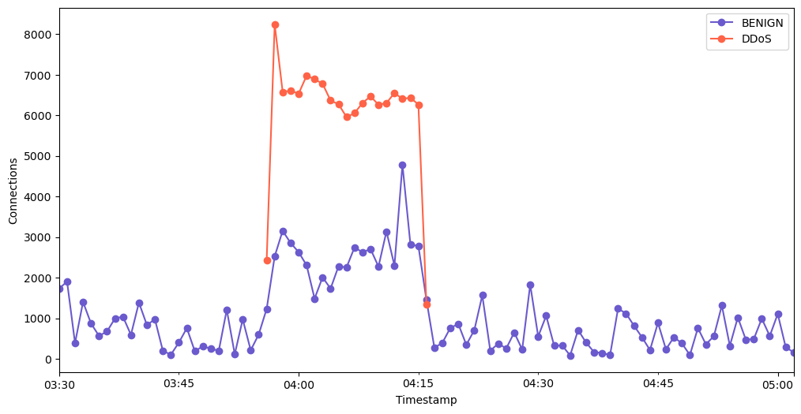

## DDoS Attack Detection with Stacked-LSTM and Real-Time Inference

Developed a 4-layer stacked-LSTM model to detect DDoS attacks, achieving **95.16% accuracy** on the CIC-DDoS2019 dataset using PyTorch and Numpy. The project involved:

  

- **Data Processing:** 
  - Utilized **PySpark** to process and combine data from 11 different network packet sources into a single NumPy object for training and testing.
  
- **Model Development:**
  - Implemented a 4-layer stacked-LSTM model in **PyTorch** for time-series classification to differentiate between benign and DDoS attack traffic.

- **Real-Time Inference with Apache Kafka:**
  - Created a **Kafka Producer** to simulate real-time network packet flow using test data.
  - Developed a **Kafka Consumer** that takes in packets in real-time, performs inference with the trained LSTM model, and classifies them as DDoS or benign traffic.

- **Evaluation**:
    The performance of the model was evaluated using various metrics and visualizations to assess its ability to detect DDoS attacks accurately:

    - **Accuracy:** 95.16%  
    - **Precision:** 99.89%  
    - **Recall:** 93.55%  
    - **F1 Score:** 96.69%

  

### Technologies Used:
- **PyTorch**: For building and training the stacked-LSTM model.
- **Kafka**: For simulating real-time packet flow (Producer and Consumer).
- **PySpark**: For data preprocessing and combining multiple data sources.
- **Seaborn/Matplotlib**: For data visualization.
- **NumPy**: For handling and manipulating data.
